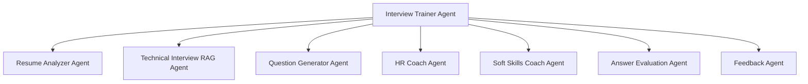
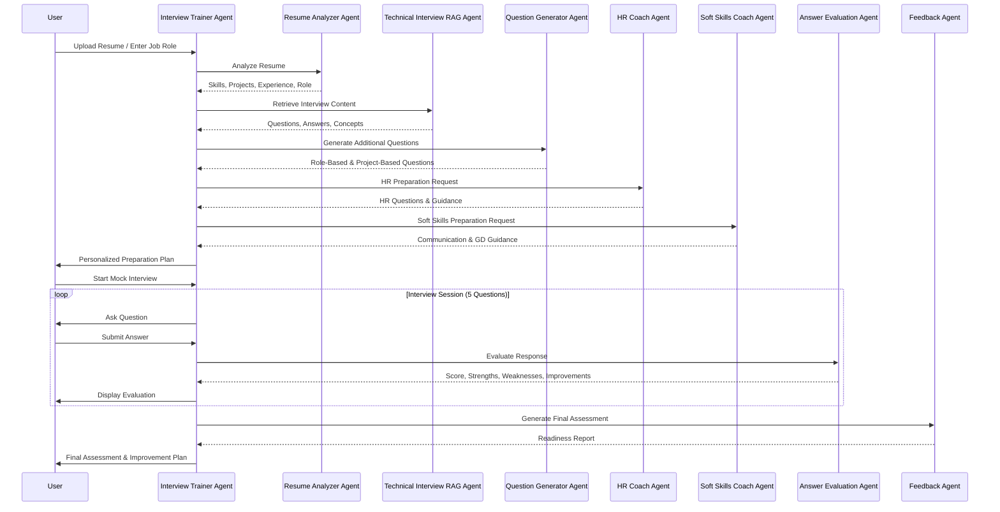

# Agent Design Document

# AI Interview Trainer Agent

## Overview

The AI Interview Trainer platform follows a Multi-Agent Architecture pattern where a central Interview Trainer Agent coordinates multiple specialized agents to deliver personalized interview preparation, mock interviews, answer evaluation, and readiness assessments.

Each agent is designed with a specific responsibility and collaborates with other agents to provide an end-to-end interview preparation experience.

---

# Agent Architecture

---

# 1. Interview Trainer Agent

## Purpose

Acts as the central orchestrator of the system.

It coordinates all specialized agents and serves as the primary interface between the user and the platform.

---

## Responsibilities

* Accept user requests
* Determine user intent
* Route requests to specialized agents
* Coordinate interview preparation
* Conduct mock interviews
* Manage interview sessions
* Generate unified responses

---

## Inputs

* Resume
* Job Role
* Skills
* Experience Level
* Company Name
* User Questions

---

## Outputs

* Interview Preparation Plans
* Mock Interviews
* Personalized Guidance
* Final Assessment Reports

---

# 2. Resume Analyzer Agent

## Purpose

Analyze candidate resumes and build candidate profiles.

---

## Responsibilities

* Resume parsing
* Skill extraction
* Project identification
* Experience evaluation
* Education extraction
* Role recommendation

---

## Inputs

* Resume PDF
* Resume Text
* Candidate Profile

---

## Outputs

### Resume Analysis Report

* Candidate Name
* Skills
* Projects
* Education
* Experience Level
* Recommended Roles

---

# 3. Technical Interview RAG Agent

## Purpose

Provide technical interview preparation using Retrieval-Augmented Generation (RAG).

---

## Responsibilities

* Retrieve interview questions
* Retrieve model answers
* Retrieve key concepts
* Retrieve interview tips
* Retrieve common mistakes
* Retrieve company-specific questions

---

## Knowledge Sources

* Java
* Spring Boot
* MySQL
* DSA
* Company Interview Questions

---

## Inputs

* Skill
* Job Role
* Company Name
* Experience Level

---

## Outputs

* Interview Questions
* Model Answers
* Key Concepts
* Preparation Strategies

---

# 4. Question Generator Agent

## Purpose

Generate additional interview questions when suitable content is unavailable in the knowledge base.

---

## Responsibilities

* Generate role-specific questions
* Generate project-based questions
* Generate experience-based questions
* Generate company-specific questions

---

## Inputs

* Role
* Skills
* Experience
* Projects

---

## Outputs

* Custom Interview Questions
* Follow-up Questions
* Scenario-Based Questions

---

# 5. HR Coach Agent

## Purpose

Prepare candidates for HR and behavioral interviews.

---

## Responsibilities

* HR interview preparation
* Behavioral interview coaching
* Career guidance
* Salary discussion preparation

---

## Inputs

* Candidate Profile
* Experience Level

---

## Outputs

### HR Preparation Content

* Tell Me About Yourself
* Strengths and Weaknesses
* Career Goals
* Salary Expectations
* Behavioral Questions

---

# 6. Soft Skills Coach Agent

## Purpose

Improve communication and interpersonal skills.

---

## Responsibilities

* Communication coaching
* Leadership coaching
* Teamwork coaching
* Group discussion preparation
* Confidence building

---

## Inputs

* Candidate Profile
* User Requests

---

## Outputs

### Soft Skills Guidance

* Self Introduction
* Communication Tips
* GD Preparation
* Leadership Guidance
* Teamwork Coaching

---

# 7. Answer Evaluation Agent

## Purpose

Evaluate candidate responses during mock interviews.

---

## Responsibilities

* Analyze answers
* Assign scores
* Identify missing concepts
* Identify weak areas
* Suggest improvements

---

## Inputs

* Interview Question
* Candidate Answer
* Expected Concepts

---

## Outputs

### Evaluation Report

* Score (/10)
* Strengths
* Weaknesses
* Missing Concepts
* Improvement Suggestions

---

# 8. Feedback Agent

## Purpose

Generate the final interview readiness assessment.

---

## Responsibilities

* Aggregate interview scores
* Analyze strengths
* Analyze weaknesses
* Calculate readiness level
* Generate improvement plans

---

## Inputs

* Question Scores
* Evaluation Reports
* Candidate Profile

---

## Outputs

### Final Assessment Report

* Overall Score
* Technical Assessment
* Communication Assessment
* Strength Analysis
* Weakness Analysis
* Improvement Plan
* Interview Readiness Level

---

## Agent Interaction Flow

---

# Design Benefits

* Separation of Responsibilities
* Modular Architecture
* Easy Scalability
* Reusable Agents
* Personalized Preparation
* RAG-Powered Knowledge Retrieval
* Automated Assessment
* Comprehensive Interview Coaching

---

# Conclusion

The AI Interview Trainer platform uses a specialized multi-agent architecture to provide intelligent, scalable, and personalized interview preparation. Each agent performs a dedicated role, enabling the system to deliver technical coaching, HR preparation, answer evaluation, and readiness assessment through a coordinated workflow.
