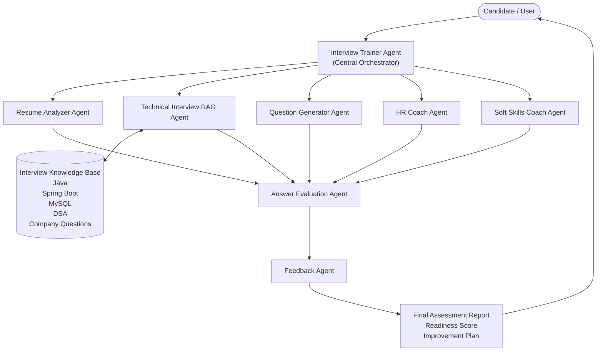
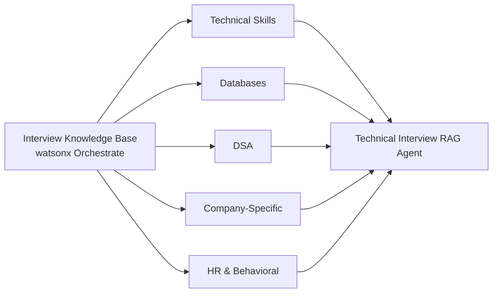
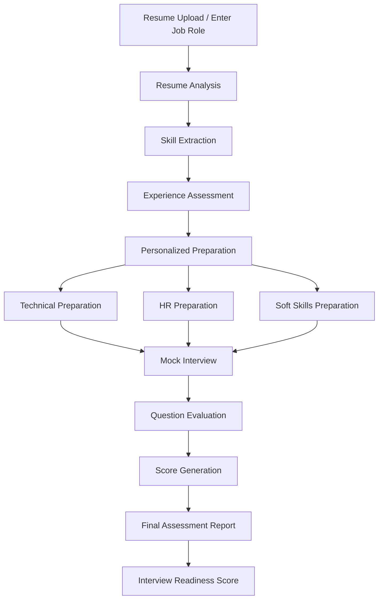

# Architecture Document

# AI Interview Trainer Agent

## Overview

The AI Interview Trainer Agent is a multi-agent interview preparation platform built using IBM watsonx Orchestrate and Retrieval-Augmented Generation (RAG).

The system helps candidates prepare for technical interviews, HR interviews, behavioral interviews, communication rounds, and mock assessments through a coordinated network of specialized AI agents.

The platform analyzes candidate profiles, retrieves interview knowledge from a curated knowledge base, evaluates responses, and generates personalized readiness assessments.

This document covers the **IBM watsonx Orchestrate agent layer** (orchestrator, specialized agents, and RAG). For the full stack — Next.js frontend, BFF API routes, PostgreSQL, auth, and voice — see the [root README](../README.md#architecture).

---

# System Architecture

The platform follows a Multi-Agent Architecture pattern.

A central Interview Trainer Agent acts as the orchestrator and coordinates specialized agents to perform interview preparation and assessment tasks.

Categories in the knowledge base include technical skills, databases, DSA, company-specific content, and HR topics — maintained privately in IBM watsonx Orchestrate.

---

# Agent Architecture

## Interview Trainer Agent

Acts as the primary interface between the candidate and the system.

Responsibilities:

* Resume handling
* Preparation guidance
* Mock interview coordination
* Agent orchestration
* Final response generation

---

## Resume Analyzer Agent

Responsibilities:

* Resume analysis
* Skill extraction
* Experience assessment
* Education analysis
* Role recommendation

Outputs:

* Candidate profile
* Skill summary
* Recommended roles

---

## Technical Interview RAG Agent

Responsibilities:

* Retrieve technical interview content
* Retrieve model answers
* Retrieve key concepts
* Retrieve common mistakes
* Retrieve company-specific questions

Knowledge Sources:

* Technical skills (languages, frameworks)
* Databases
* Data structures and algorithms
* Company-specific interview content
* HR and behavioral topics

Content is maintained privately in IBM watsonx Orchestrate. See [KNOWLEDGE_BASE_DESIGN.md](./KNOWLEDGE_BASE_DESIGN.md).

---

## Question Generator Agent

Responsibilities:

* Generate role-specific questions
* Generate project-based questions
* Generate additional interview questions
* Generate fallback questions when RAG content is unavailable

---

## HR Coach Agent

Responsibilities:

* HR interview preparation
* Behavioral interview coaching
* Career guidance
* Salary discussion preparation

---

## Soft Skills Coach Agent

Responsibilities:

* Communication coaching
* Leadership coaching
* Teamwork coaching
* Group discussion preparation
* Confidence building

---

## Answer Evaluation Agent

Responsibilities:

* Evaluate candidate responses
* Assign scores
* Identify missing concepts
* Suggest improvements

Scoring Range:

0 - 10

---

## Feedback Agent

Responsibilities:

* Generate final assessment report
* Calculate readiness level
* Identify strengths
* Identify weaknesses
* Create improvement plans

---

# Knowledge Base Architecture

The platform uses Retrieval-Augmented Generation (RAG) to retrieve relevant interview preparation content.

Interview content is maintained in the IBM watsonx Orchestrate Knowledge Base (not in this repository). See [KNOWLEDGE_BASE_DESIGN.md](./KNOWLEDGE_BASE_DESIGN.md) for structure and format.

---

# Workflow Architecture

---

# Data Flow

Step 1:
Candidate uploads resume or specifies a job role.

Step 2:
Resume Analyzer Agent extracts skills, projects, education, and experience.

Step 3:
Interview Trainer Agent creates a candidate profile.

Step 4:
Technical Interview RAG Agent retrieves relevant interview content from the knowledge base.

Step 5:
Question Generator Agent creates additional questions when required.

Step 6:
HR Coach Agent and Soft Skills Coach Agent provide non-technical preparation.

Step 7:
Mock interview is conducted.

Step 8:
Answer Evaluation Agent evaluates responses.

Step 9:
Feedback Agent generates the final assessment report.

Step 10:
Interview readiness score and improvement plan are presented to the candidate.

---

# Design Benefits

* Modular architecture
* Scalable multi-agent design
* Personalized interview preparation
* RAG-powered knowledge retrieval
* Technical and non-technical coaching
* Automated answer evaluation
* End-to-end interview readiness assessment

---

# Conclusion

The AI Interview Trainer Agent provides a complete interview preparation ecosystem by combining IBM watsonx Orchestrate, Multi-Agent Architecture, and Retrieval-Augmented Generation (RAG).

The platform delivers personalized interview coaching, mock assessments, answer evaluation, and readiness reporting, helping candidates improve confidence and succeed in competitive hiring environments.
