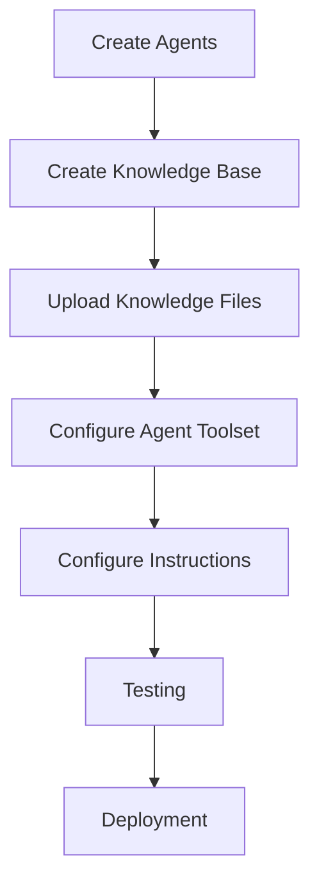

# Setup Guide

# AI Interview Trainer Agent

## Overview

This guide explains how to set up and deploy the AI Interview Trainer Agent using IBM watsonx Orchestrate.

The platform uses:

* IBM watsonx Orchestrate
* Multi-Agent Architecture
* Retrieval-Augmented Generation (RAG)
* Interview Knowledge Base

---

# Prerequisites

Before starting, ensure you have:

## IBM Cloud Account

Create an IBM Cloud account:

https://cloud.ibm.com

---

## IBM watsonx Orchestrate Access

Required services:

* IBM watsonx Orchestrate
* Agent Builder
* Knowledge Base
* Agent Tools

---

# Project Components

The project consists of:

## Main Agent

* Interview Trainer Agent

## Specialized Agents

* Resume Analyzer Agent
* Technical Interview RAG Agent
* Question Generator Agent
* HR Coach Agent
* Soft Skills Coach Agent
* Answer Evaluation Agent
* Feedback Agent

---

# Step 1: Create the Main Agent

Navigate to:

```text
watsonx Orchestrate
→ Agents
→ Create Agent
```

Agent Name:

```text
Interview Trainer Agent
```

Description:

```text
AI-powered interview preparation assistant using RAG and multi-agent orchestration.
```

---

# Step 2: Create Specialized Agents

Create the following agents:

---

## Resume Analyzer Agent

Purpose:

```text
Analyze resumes and extract skills, projects, experience, and education.
```

---

## Technical Interview RAG Agent

Purpose:

```text
Retrieve interview questions and answers from the knowledge base.
```

---

## Question Generator Agent

Purpose:

```text
Generate role-based and project-based interview questions.
```

---

## HR Coach Agent

Purpose:

```text
Provide HR interview preparation and coaching.
```

---

## Soft Skills Coach Agent

Purpose:

```text
Provide communication, leadership, and group discussion preparation.
```

---

## Answer Evaluation Agent

Purpose:

```text
Evaluate candidate responses and generate scores.
```

---

## Feedback Agent

Purpose:

```text
Generate final interview readiness reports.
```

---

# Step 3: Create the Knowledge Base

Navigate to:

```text
Knowledge
→ Create Knowledge Base
```

Knowledge Base Name:

```text
Interview Knowledge Base
```

---

# Step 4: Upload Knowledge Files

Prepare structured TXT files for each domain (technology, company, HR topic, etc.) and upload them to the Interview Knowledge Base.

Content is not included in this repository — create or maintain your own interview preparation files privately, then upload them in watsonx Orchestrate:

```text
Knowledge → Interview Knowledge Base → Upload
```

Use one file per domain. File naming is flexible; keep names descriptive for your team (e.g. by skill, framework, or company).

---

# Recommended Knowledge Format

```text
Role: Java Developer

Question:
What is JVM?

Expected Answer:
JVM stands for Java Virtual Machine.

Difficulty:
Easy

Skill:
Java

Experience:
Fresher
```

---

# Step 5: Configure Technical Interview RAG Agent

Attach:

```text
Interview Knowledge Base
```

Responsibilities:

* Retrieve interview questions
* Retrieve model answers
* Retrieve key concepts
* Retrieve interview tips
* Retrieve common mistakes

---

# Step 6: Configure Agent Toolset

Open:

```text
Interview Trainer Agent
→ Toolset
```

Add:

```text
Resume Analyzer Agent
Technical Interview RAG Agent
Question Generator Agent
HR Coach Agent
Soft Skills Coach Agent
Answer Evaluation Agent
Feedback Agent
```

---

# Step 7: Configure Agent Instructions

Configure the Interview Trainer Agent with:

* Resume Analysis Workflow
* Technical Preparation Workflow
* HR Preparation Workflow
* Soft Skills Workflow
* Mock Interview Workflow
* Assessment Workflow

The agent should act as a central orchestrator and coordinate all specialized agents.

---

# Step 8: Configure Mock Interview Workflow

Mock Interview Requirements:

* 5 Questions
* One Question at a Time
* Answer Evaluation
* Score Generation
* Final Assessment Report

Scoring Scale:

```text
0 - 10
```

for every question.

---

# Step 9: Configure Voice Support

Navigate to:

```text
Channels
→ Voice Settings
```

Configure:

* Speech-to-Text
* Text-to-Speech
* Voice Model

Benefits:

* Voice Interviews
* Hands-Free Practice
* Realistic Interview Simulation

---

# Step 10: Deploy the Agent

Navigate to:

```text
Interview Trainer Agent
→ Publish
```

Deployment Modes:

* Draft
* Live

Use:

```text
Live
```

for production testing.

---

# Testing the System

## Resume Analysis Test

Input:

```text
Upload Resume
```

Expected Result:

* Skills Extracted
* Projects Extracted
* Education Extracted
* Experience Level Determined
* Recommended Roles Generated

---

## Technical Preparation Test

Input:

```text
Prepare me for Java Developer Interview
```

Expected Result:

* Questions
* Answers
* Concepts
* Tips

---

## HR Preparation Test

Input:

```text
Prepare me for HR Interview
```

Expected Result:

* HR Questions
* Communication Tips
* Behavioral Guidance

---

## Mock Interview Test

Input:

```text
Start Mock Interview
```

Expected Result:

* Question-by-Question Assessment
* Answer Evaluation
* Scoring
* Final Report

---

# Deployment Workflow



---

# Validation Checklist

Before deployment, verify:

* Resume Analyzer Agent configured
* Technical RAG Agent connected
* Knowledge Base attached
* Question Generator Agent configured
* HR Coach Agent configured
* Soft Skills Coach Agent configured
* Answer Evaluation Agent configured
* Feedback Agent configured
* Mock Interview Workflow tested
* Voice Support tested (optional)

---

# Conclusion

Following this setup guide enables the deployment of a complete AI Interview Trainer platform using IBM watsonx Orchestrate, Multi-Agent Architecture, and Retrieval-Augmented Generation (RAG).

The resulting system supports personalized interview preparation, mock assessments, answer evaluation, and interview readiness reporting.
